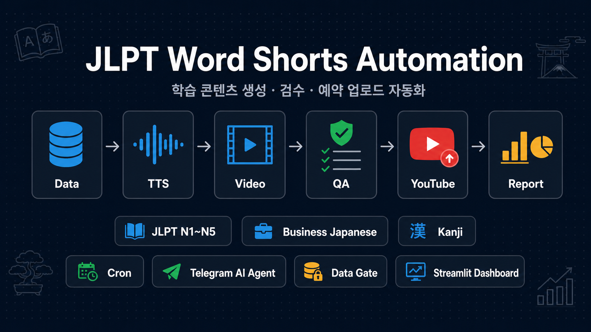
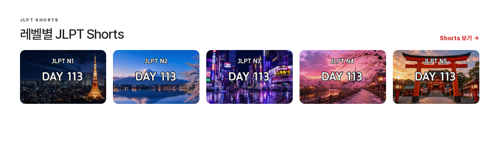
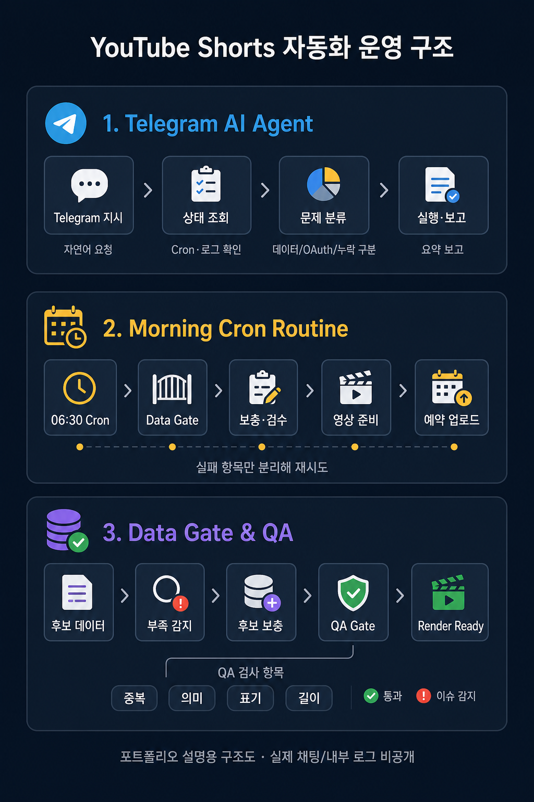

# JLPT Word Shorts Automation

🗓 운영기간 : 2026년 7월 ~ 운영 중  
📌 프로젝트 유형 : YouTube Shorts 콘텐츠 생성·검수·예약 업로드 자동화  
🧩 역할 : 자동화 흐름 설계, 데이터 검수 기준 정리, 운영 상태 확인, 실패 복구 루프 관리

> JLPT N1~N5, 비즈니스 일본어, 한자 학습용 Shorts 콘텐츠를 데이터 준비부터 영상 생성, 검수, YouTube 예약 업로드, 운영 보고까지 연결한 Python 기반 자동화 프로젝트입니다.  
> OAuth 토큰, 개인 API 키, 채널 내부 ID, 민감 로그, 실제 생성 결과물은 공개 저장소에 포함하지 않습니다.

<br />

# 목차

1. [프로젝트 소개](#-프로젝트-소개)
2. [자동화 파이프라인](#-자동화-파이프라인)
3. [핵심 기능](#-핵심-기능)
4. [기술 스택](#-기술-스택)
5. [프로젝트 구조](#-프로젝트-구조)
6. [실행 방법](#-실행-방법)
7. [운영·검증 기준](#-운영검증-기준)
8. [보안 원칙](#-보안-원칙)
9. [포트폴리오 요약](#-포트폴리오-요약)

<br />

# 📖 프로젝트 소개

반복적으로 제작되는 학습형 Shorts 콘텐츠는 사람이 매번 직접 만들고 업로드하면 시간이 많이 들고, 누락·예약 실패·데이터 부족을 놓치기 쉽습니다.

이 프로젝트는 콘텐츠 운영을 다음 단계로 나누었습니다.

```text
학습 데이터 준비
→ 후보 수량/내용 검수
→ TTS·이미지·영상 생성
→ 썸네일 생성
→ YouTube 공개/예약 업로드
→ Google Drive 백업
→ 상태 확인 및 실패 항목 복구
```

핵심은 단순히 영상을 많이 만드는 것이 아니라, **반복 콘텐츠 운영을 단계별로 분리하고 실패 지점을 추적해 운영이 멈추지 않도록 만드는 것**입니다.

<br />

# 🔁 자동화 파이프라인



## 기본 흐름

```text
1. 데이터 준비
   - CSV 기반 JLPT N1~N5 단어·문법 후보 관리
   - 비즈니스 일본어 단어·표현 후보 분리 관리
   - 사용한 항목과 남은 후보를 DAY 단위로 정리

2. 콘텐츠 생성
   - 레벨/채널별 학습 콘텐츠 구성
   - 일본어/한국어 TTS 음성 생성
   - 카드 이미지, Shorts 영상, 썸네일 생성

3. 품질 확인
   - 후보 수량, 의미, 표기, 화면 길이, 영상 파일 존재 여부 확인
   - 일본어 표기와 학습자용 한국어 의미 오류 점검

4. YouTube 업로드
   - 공개 업로드 또는 예약 업로드
   - 업로드 로그와 예약 시간 관리

5. 백업 및 정리
   - Google Drive 백업
   - 백업 성공 후 로컬 산출물 정리

6. 복구 처리
   - 후보 부족, OAuth 만료, YouTube 제한, 렌더링 실패를 분리
   - 실패 항목만 재시도 가능한 상태로 보존
```

<br />

# 📝 핵심 기능

| 기능 | 설명 |
|---|---|
| JLPT N1~N5 DAY 학습 세트 | CSV에서 미사용 단어·문법 후보를 선별해 DAY 단위 학습 세트를 구성합니다. |
| 비즈니스 일본어 분리 운영 | JLPT 데이터와 별도로 비즈니스 단어·표현 콘텐츠를 생성합니다. |
| TTS·이미지·영상 자동 생성 | 일본어/한국어 음성, 카드 이미지, 단어별 Shorts, DAY 영상, 썸네일을 자동 생성합니다. |
| YouTube 공개·예약 업로드 | 생성된 영상을 공개 또는 예약 업로드하고 업로드 이력을 관리합니다. |
| Streamlit 운영 대시보드 | 생성, 업로드, 예약 시간 변경, 로그 확인을 화면에서 수동으로 실행할 수 있습니다. |
| Telegram AI Agent 운영 | 자연어 요청으로 상태 확인, 문제 분류, 복구·재생성 판단을 보조합니다. |
| 실패 항목 보존 및 재시도 | 업로드 실패라고 해서 영상 파일을 삭제하지 않고 재시도 가능한 상태로 보존합니다. |

<br />

# ✨ 기술 스택

<b>Automation / Backend</b>
<p align="left">
  
  
  
</p>

<b>Media / Content</b>
<p align="left">
  
  
  
  
  
</p>

<b>Upload / Operations</b>
<p align="left">
  
  
  
</p>

<br />

# 🗂 프로젝트 구조

```text
jlpt_word/
├─ assets/                         # 영상 생성에 쓰는 배경/폰트 자산
│  ├─ backgrounds/                 # 카드 배경 이미지
│  └─ fonts/                       # 일본어/한국어 렌더링용 폰트
│
├─ data/                           # 콘텐츠 원천 데이터
│  ├─ jlpt_n1_vocab.csv            # N1 단어 후보
│  ├─ jlpt_n1_grammar.csv          # N1 문법 후보
│  ├─ ...
│  ├─ business_japanese_vocab.csv  # 비즈니스 일본어 단어 후보
│  └─ business_japanese_phrases.csv# 비즈니스 일본어 표현 후보
│
├─ docs/                           # 프로젝트 설명과 README 이미지
│  ├─ PROJECT_STRUCTURE.md
│  ├─ EXECUTION_FLOW.md
│  └─ assets/readme/
│
├─ src/                            # 기능별 모듈
│  ├─ cleanup/                     # 업로드 후 로컬 산출물 정리
│  ├─ data/                        # CSV/JSON 데이터 처리
│  ├─ drive/                       # Google Drive 백업
│  ├─ image/                       # 카드 이미지/썸네일 생성
│  ├─ notifications/               # Telegram 알림/보고
│  ├─ ops/                         # 운영 자동화/상태 점검 로직
│  ├─ tts/                         # TTS 음성 생성
│  ├─ video/                       # Shorts/풀영상 생성
│  └─ youtube/                     # YouTube 업로드/예약 처리
│
├─ tests/                          # 운영 로직 테스트
├─ main.py                         # JLPT 생성 메인 실행 파일
├─ main_business.py                # 비즈니스 일본어 생성 실행 파일
├─ automation_runner.py            # 생성·업로드 자동화 러너
├─ streamlit_app.py                # Streamlit 운영 대시보드
└─ requirements.txt
```

<br />

# 💻 실행 방법

## 설치

```bash
pip install -r requirements.txt
```

## 환경변수

`.env.example`을 참고해 `.env` 파일을 생성합니다.

```env
OPENAI_API_KEY=your_openai_api_key
UPLOAD_PUBLISH_AT=
```

## OAuth 파일

실제 YouTube 업로드와 Google Drive 백업을 사용하려면 로컬에 아래 파일이 필요합니다.

```text
client_secret.json
YouTube token file
Drive token file
```

이 파일들은 공개 저장소에 커밋하지 않습니다.

## 실행

```bash
# JLPT 메인 파이프라인
python main.py

# 비즈니스 일본어 파이프라인
python main_business.py

# Streamlit 운영 대시보드
streamlit run streamlit_app.py
```

<br />

# ✅ 운영·검증 기준

## 운영 구조 요약



위 이미지는 실제 채팅 캡처가 아니라, 포트폴리오 설명을 위한 운영 구조도입니다. 아래 운영·검증 기준은 이 구조도를 기준으로 정리했습니다.

| 영역 | 설명 |
|---|---|
| Telegram AI Agent | Telegram에서 자연어로 상태 확인, 복구, 재생성 요청을 보낼 수 있는 운영 인터페이스입니다. |
| Morning Cron Routine | 매일 아침 Cron이 생성 대상, 업로드 슬롯, 실패 항목을 점검하고 필요한 작업을 준비합니다. |
| Data Gate & QA | 후보 데이터가 부족하면 보충하고, 중복·의미·표기·길이 검수를 통과한 항목만 영상 생성으로 넘깁니다. |

공개 저장소에는 실제 채팅 내용, 채널 ID, 영상 URL, 내부 로그를 포함하지 않고 구조와 운영 방식만 설명합니다.

## Telegram AI Agent 운영

```text
Telegram 자연어 요청
→ AI Agent가 채널/레벨/날짜 범위 파악
→ 생성 로그, 업로드 로그, DAY 상태, 예약 상태 확인
→ 후보 데이터 부족, OAuth 만료, YouTube 제한, 영상 누락 구분
→ 필요한 작업 실행 또는 사용자 승인 요청
→ 결과만 한국어로 요약 보고
```

## 매일 아침 Cron 운영

| 운영 항목 | 역할 |
|---|---|
| 생성 Cron | 다음 DAY 콘텐츠 후보를 확인하고 영상·썸네일 생성 |
| 업로드 Cron | 생성된 영상을 공개 또는 예약 업로드 |
| 복구 Cron | 실패·대기 항목을 주기적으로 확인하고 재시도 |
| 보고 Cron | 성공/실패/사용자 조치 필요 여부를 Telegram으로 요약 |

Cron 운영의 기준은 **한 작업이 실패해도 다른 채널이나 다른 레벨이 불필요하게 스킵되지 않도록 분리하는 것**입니다.

## 데이터 부족 감지·검수

```text
데이터 게이트 확인
→ 부족한 레벨/유형 식별
→ 후보 데이터 보충
→ 의미·중복·표기·길이 검수
→ 생성 게이트 재실행
→ 영상 생성/업로드 재개
```

| 검수 항목 | 확인 내용 |
|---|---|
| 수량 | DAY 생성에 필요한 단어/문법/표현 후보가 충분한지 |
| 중복 | 이미 사용한 항목이나 같은 의미의 반복 후보가 아닌지 |
| 의미 | 학습자에게 자연스러운 한국어 의미인지 |
| 표기 | 일본어, 히라가나, 한국어 뜻이 섞이거나 깨지지 않았는지 |
| 영상 적합성 | 화면에 들어갈 길이인지, TTS가 어색하지 않은지 |
| 공개 위험 | 공식 시험 문제 복제나 합격 보장처럼 오해될 표현이 없는지 |

<br />

# 🔐 보안 원칙

이 저장소에는 다음 파일을 포함하지 않습니다.

```text
.env
client_secret.json
token.json
drive_token.json
업로드 로그 원본
실제 생성 영상/음성 파일
채널 내부 ID
```

`.gitignore`로 로그, PID, 백업 파일, ZIP/EXE, 로컬 산출물, OAuth 관련 파일이 다시 커밋되지 않도록 관리합니다.

<br />

# 📌 포트폴리오 요약

## Problem

학습형 Shorts 콘텐츠를 매일 반복 제작·업로드하는 과정에서 데이터 부족, 영상 누락, 예약 실패, OAuth 문제를 사람이 일일이 확인하기 어렵습니다.

## Action

콘텐츠 후보 데이터, TTS, 이미지, 영상, 썸네일, YouTube 업로드, Drive 백업, Telegram 보고를 단계별 파이프라인으로 나누고, Cron과 AI Agent 운영 흐름을 연결했습니다.

## Result

반복 콘텐츠 운영을 수동 작업이 아니라 **상태 확인·검수·복구가 가능한 자동화 루틴**으로 정리했습니다.

```text
데이터 기반 콘텐츠 생성
+ 영상/썸네일 자동 생성
+ YouTube 예약 업로드
+ Telegram 운영 보고
+ 실패 항목 재시도/복구
```
