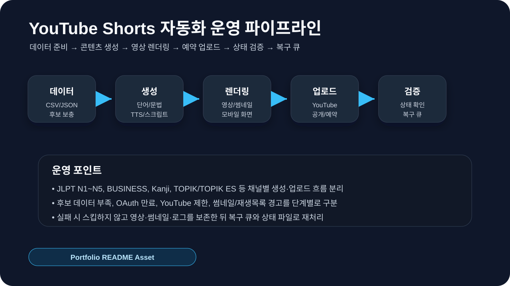

# JLPT Word Shorts Automation

🗓 운영기간 : 2026년 7월 ~ 운영 중  
📌 프로젝트 유형 : YouTube Shorts 콘텐츠 생성·검수·예약 업로드 자동화  
🧩 역할 : 자동화 흐름 설계, 운영 상태 확인, 오류 복구 기준 정리, 품질 검수 루프 관리

> 이 프로젝트는 반복 학습 콘텐츠를 무인으로 방치하는 시스템이 아니라, 콘텐츠 생성·업로드·상태 확인 과정을 자동화하고 오류 발생 시 사람이 확인·복구할 수 있도록 만든 운영 자동화 프로젝트입니다. OAuth 토큰, 개인 API 키, 채널 내부 ID, 민감 로그, 생성 결과물은 공개 저장소에 포함하지 않습니다.

<br />

# 목차

1. [프로젝트 소개](#-프로젝트-소개)
2. [자동화 흐름](#-자동화-흐름)
3. [주요 기능](#-주요-기능)
4. [기술 스택](#-기술-스택)
5. [디렉토리 구조](#%EF%B8%8F-디렉토리-구조)
6. [실행 방법](#-실행-방법)
7. [검증 및 복구 방식](#-검증-및-복구-방식)
8. [보안 및 신뢰성 원칙](#-보안-및-신뢰성-원칙)
9. [포트폴리오 요약](#-포트폴리오-요약)

<br />

# 📖 프로젝트 소개

`JLPT Word Shorts Automation`은 JLPT N1~N5 단어·문법 학습 콘텐츠와 비즈니스 일본어 학습 콘텐츠를 Shorts 영상으로 생성하고, YouTube 업로드와 Google Drive 백업까지 연결하는 Python 기반 운영 자동화 프로젝트입니다.

반복적으로 제작되는 학습형 Shorts 콘텐츠는 사람이 매번 직접 만들고 업로드하면 시간이 많이 들고, 영상 누락이나 예약 실패를 놓치기 쉽습니다. 이 프로젝트는 반복 업무를 아래 흐름으로 나누어 운영합니다.

```text
콘텐츠 데이터 준비
→ 단어/문법/표현 후보 검수
→ TTS·영상·썸네일 생성
→ YouTube 공개/예약 업로드
→ Google Drive 백업
→ 업로드 상태 확인
→ 실패 항목 재시도·복구
```

핵심은 단순히 영상을 많이 만드는 것이 아니라, **반복 콘텐츠 운영을 단계로 나누고 실패 지점을 구분해서 운영이 멈추지 않도록 관리하는 것**입니다.

<br />

# 🔁 자동화 흐름


<br />

```text
1. 데이터 준비
   - CSV 기반 JLPT N1~N5 단어·문법 후보 관리
   - 비즈니스 일본어 단어·표현 후보 관리
   - 사용한 항목과 남은 후보를 DAY 단위로 정리

2. 콘텐츠 생성
   - 레벨/채널별 학습 콘텐츠 구성
   - 일본어/한국어 TTS 음성 생성
   - 카드 이미지, Shorts 영상, 썸네일 생성

3. 품질 확인
   - 후보 수량, 의미, 발음, 화면 텍스트, 영상 길이 확인
   - 일본어 표기와 학습자용 의미 오류 점검

4. YouTube 업로드
   - 공개 업로드 또는 예약 업로드
   - 업로드 로그와 예약 시간 관리

5. Drive 백업 및 정리
   - 업로드된 영상과 썸네일을 Drive에 백업
   - 백업 성공 후 로컬 생성물 정리

6. 복구 처리
   - 후보 부족, OAuth 만료, YouTube 제한, 렌더링 실패를 분리
   - 영상과 썸네일을 보존한 뒤 재시도 또는 수동 복구
```

<br />

# 📝 주요 기능

✅ `JLPT N1~N5 DAY 학습 세트 구성`  
CSV에서 미사용 단어·문법 후보를 선별해 DAY 단위 학습 세트를 구성합니다. 레벨별 데이터 사용 상태를 분리해 관리합니다.

<br />

✅ `비즈니스 일본어 콘텐츠 분리 운영`  
JLPT 학습 콘텐츠와 별도로 비즈니스 일본어 단어·표현 콘텐츠를 생성합니다. 일반 JLPT 데이터와 비즈니스 표현 데이터를 섞지 않도록 별도 CSV와 실행 흐름을 둡니다.

<br />

✅ `TTS·이미지·영상 자동 생성`  
일본어/한국어 음성, 카드 이미지, 단어별 Shorts 영상, DAY 단위 영상, 썸네일을 자동 생성합니다. 반복 작업을 사람 손으로 매번 하지 않도록 생성 단계를 분리했습니다.

<br />

✅ `YouTube 공개·예약 업로드`  
생성된 영상을 YouTube에 공개 또는 예약 업로드합니다. 이미 지난 공개 슬롯은 즉시 공개 상태로 복구하고, 아직 도래하지 않은 슬롯은 예약 상태로 유지합니다.

<br />

✅ `Google Drive 백업과 로컬 정리`  
업로드된 영상과 썸네일을 Drive에 백업한 뒤, 백업이 성공한 경우에만 로컬 생성물을 정리합니다. 업로드 성공과 백업 실패를 분리해 판단합니다.

<br />

✅ `Streamlit 운영 대시보드`  
생성만 실행, 업로드만 실행, 전체 실행, 예약 시간 변경, 실행 로그 확인 같은 운영 작업을 Streamlit 화면에서 제어할 수 있도록 구성했습니다.

<br />

✅ `실패 항목 보존 및 재시도`  
영상 생성 실패와 YouTube 업로드 실패를 분리해서 판단합니다. 업로드 실패라고 해서 영상 파일을 삭제하지 않고, 재시도 가능한 상태로 보존합니다.

<br />

# ✨ 기술 스택

<br />

<b>Automation / Backend</b>
<p align="left">
  
  
  
</p>

<b>Media / Content</b>
<p align="left">
  
  
  
  
  
</p>

<b>Upload / Operations</b>
<p align="left">
  
  
  
</p>

<br />

# 🗂️ 디렉토리 구조

```text
jlpt_word/
├─ assets/                         # 영상 생성에 쓰는 이미지, 음성, 폰트 자산
│  ├─ backgrounds/                 # 카드 배경 이미지
│  ├─ fonts/                       # 일본어/한국어 렌더링용 폰트
│  ├─ audio/                       # 생성된 TTS 음성 파일
│  └─ images/                      # 단어 카드 이미지
│
├─ data/                           # 콘텐츠 원천 데이터와 실행 상태
│  ├─ jlpt_n1_vocab.csv            # N1 단어 후보
│  ├─ jlpt_n1_grammar.csv          # N1 문법 후보
│  ├─ jlpt_n2_vocab.csv            # N2 단어 후보
│  ├─ jlpt_n2_grammar.csv          # N2 문법 후보
│  ├─ jlpt_n3_vocab.csv            # N3 단어 후보
│  ├─ jlpt_n3_grammar.csv          # N3 문법 후보
│  ├─ jlpt_n4_vocab.csv            # N4 단어 후보
│  ├─ jlpt_n4_grammar.csv          # N4 문법 후보
│  ├─ jlpt_n5_vocab.csv            # N5 단어 후보
│  ├─ jlpt_n5_grammar.csv          # N5 문법 후보
│  ├─ business_japanese_vocab.csv  # 비즈니스 일본어 단어 후보
│  ├─ business_japanese_phrases.csv# 비즈니스 일본어 표현 후보
│  └─ frequency_result.csv         # 단어 빈도/정리 데이터
│
├─ docs/                           # 프로젝트 설명과 운영 문서
│  ├─ PORTFOLIO.md                 # 포트폴리오용 설명 문서
│  ├─ PROJECT_STRUCTURE.md         # 구조 설명 문서
│  └─ EXECUTION_FLOW.md            # 실행 흐름 문서
│
├─ src/                            # 기능별 모듈
│  ├─ cleanup/                     # 업로드 후 로컬 산출물 정리
│  ├─ data/                        # CSV/JSON 데이터 처리
│  ├─ drive/                       # Google Drive 백업
│  ├─ image/                       # 카드 이미지/썸네일 생성
│  ├─ tts/                         # TTS 음성 생성
│  ├─ video/                       # Shorts/풀영상 생성
│  └─ youtube/                     # YouTube 업로드/예약 처리
│
├─ output/                         # 생성된 영상과 썸네일 산출물
│  ├─ videos/                      # 단어별 Shorts 영상
│  ├─ day_videos/                  # DAY 단위 Shorts 영상
│  ├─ compilations/                # 25일 단위 풀영상
│  └─ thumbnails/                  # YouTube 썸네일
│
├─ main.py                         # JLPT 단어/문법 생성 메인 실행 파일
├─ main_business.py                # 비즈니스 일본어 생성 실행 파일
├─ automation_runner.py            # 생성·업로드 자동화 실행 러너
├─ streamlit_app.py                # Streamlit 운영 대시보드
├─ bot_server.py                   # 운영 보조 서버
└─ requirements.txt                # Python 의존성
```

<br />

# 💻 실행 방법

## 설치

```bash
pip install -r requirements.txt
```

## 환경변수

`.env.example`을 참고해 `.env` 파일을 생성합니다.

```env
OPENAI_API_KEY=your_openai_api_key
UPLOAD_PUBLISH_AT=
```

## OAuth 파일

실제 YouTube 업로드와 Google Drive 백업을 사용하려면 로컬에 아래 파일이 필요합니다.

```text
client_secret.json
YouTube token file
Drive token file
```

이 파일들은 공개 저장소에 커밋하지 않습니다.

## 실행

```bash
# JLPT 메인 파이프라인
python main.py

# 비즈니스 일본어 파이프라인
python main_business.py

# Streamlit 운영 대시보드
streamlit run streamlit_app.py
```

<br />

# ✅ 검증 및 복구 방식

## 생성 전 검증

```text
- 레벨별 후보 데이터 수량 확인
- 단어/문법/표현 중복 확인
- 일본어·한국어 의미 오류 점검
- 영상 길이와 화면 텍스트 길이 확인
```

## 업로드 후 검증

```text
- YouTube 업로드 성공 여부
- public/private/scheduled 상태
- 예약 시간 publishAt 확인
- 처리 완료 여부 확인
- 업로드 로그와 실제 YouTube 상태 비교
- Drive 백업 성공 여부 확인
```

## 복구 기준

| 상황 | 처리 방식 |
|---|---|
| 후보 데이터 부족 | 부족한 레벨/유형만 보충 후 재생성 |
| 영상 생성 실패 | 원인 확인 후 해당 영상만 재생성 |
| 업로드 실패 | 영상·썸네일 보존 후 재시도 대기 |
| OAuth 만료 | 해당 채널만 재인증 후 재시도 |
| YouTube 업로드 제한 | 실패 처리하지 않고 대기 후 재시도 |
| Drive 백업 실패 | YouTube 업로드 성공과 분리해 백업만 재시도 |
| 예약 시간 불일치 | 실제 YouTube 상태와 로컬 로그를 함께 비교 후 정렬 |

<br />

# 🔐 보안 및 신뢰성 원칙

- OAuth 토큰, client secret, 채널 ID, 내부 로그는 공개하지 않습니다.
- YouTube 업로드 성공과 Drive 백업 실패를 분리해서 판단합니다.
- 한 영상이 실패해도 다른 영상이 스킵되지 않도록 레벨·콘텐츠 유형별로 상태를 나눕니다.
- 영상 파일이 존재하면 즉시 삭제하지 않고 재시도 가능한 자산으로 보존합니다.
- AI가 생성한 학습 콘텐츠는 사람 검수와 데이터 게이트를 거친 뒤 업로드합니다.
- 공식 JLPT 기출을 복제하거나 공식 시험 합격을 보장하는 표현을 사용하지 않습니다.
- 사용자 보고에는 raw stack trace나 내부 후보 문구를 노출하지 않고, 조치가 필요한 상태만 요약합니다.

<br />

# 📌 포트폴리오 요약

이 프로젝트에서 보여주고 싶은 역량은 `유튜브 운영` 자체가 아니라, 반복 업무를 안정적으로 운영하기 위해 필요한 **자동화 흐름 설계와 장애 복구 사고방식**입니다.

```text
문제:
반복 학습 콘텐츠를 수동으로 제작·업로드하면 시간이 많이 들고 누락을 놓치기 쉽다.

분석:
생성 실패, 업로드 실패, 인증 만료, 데이터 부족, 예약 시간 불일치를 같은 문제로 보면 복구가 어렵다.

실행:
데이터 준비, 영상 생성, YouTube 업로드, Drive 백업, 상태 검증, 복구 기준을 분리해 단계별로 확인할 수 있도록 운영했다.

결과:
반복 학습 콘텐츠 운영을 자동화하고, 실패 항목은 스킵하지 않고 보존·재시도하는 흐름을 만들었다.
```

<br />

# 🔗 관련 링크

- JLPT Shorts YouTube: https://www.youtube.com/@hyokujlpt
- HYOKU JLPT 웹서비스: https://jlpt.hyoku.cloud
- HYOKU JLPT GitHub: https://github.com/dltkdgur1123/jlpt-quiz-agent
